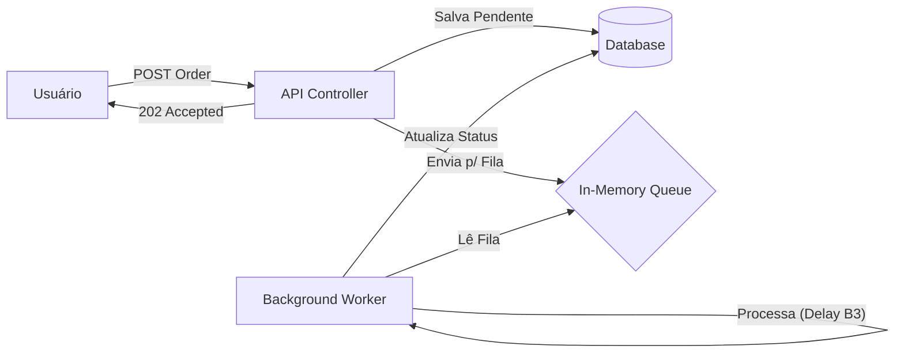

# 🐂 ToroTrade - High Performance Trading Backend

Este projeto é uma API de simulação de Home Broker, desenvolvida para demonstrar o processamento de altas cargas de ordens de compra de ações de forma assíncrona e desacoplada.

O objetivo principal é resolver o problema de latência em horários de pico (abertura de mercado), onde a API não pode travar esperando o processamento da B3. Para isso, utilizamos uma arquitetura orientada a eventos com processamento em background.

---

## 🚀 Arquitetura e Fluxo de Dados

O projeto segue os princípios da **Clean Architecture** e **SOLID**, dividindo responsabilidades em camadas distintas:

1.  **API (Entrada):** O cliente envia uma ordem de compra (`POST /api/Orders`).
2.  **Validação & Fila:** A API valida a requisição e a coloca imediatamente em uma **Fila em Memória** (`System.Threading.Channels`), retornando `202 Accepted` instantaneamente para o usuário.
3.  **Worker (Processamento):** Um serviço em background (`BackgroundService`) fica monitorando a fila. Assim que uma ordem chega, ele a consome.
4.  **Persistência:** O Worker processa a regra de negócio (simulando o tempo de resposta da Bolsa de Valores) e atualiza o status no Banco de Dados.

### 📊 Diagrama do Fluxo



🛠️ Tecnologias Utilizadas
Linguagem: C# (.NET 9)

Tipo de Projeto: Web API (ASP.NET Core)

Arquitetura: Clean Architecture (Onion Architecture)

Banco de Dados: In-Memory Database (EF Core) para alta velocidade em testes.

Mensageria: System.Threading.Channels (Alta performance intra-processo).

Documentação: Swagger (OpenAPI).

Logs: Serilog (Logs estruturados no console).

📦 Pacotes NuGet Instalados
Abaixo, a lista de dependências externas utilizadas em cada camada do sistema:

1. ToroTrade.API (Interface)
Swashbuckle.AspNetCore (v6.6.2): Para gerar a interface visual de documentação (Swagger).

Serilog.AspNetCore: Para observabilidade e logs detalhados do processamento do Worker.

2. ToroTrade.Infrastructure (Dados e Integrações)
Microsoft.EntityFrameworkCore.InMemory: Simula um banco de dados SQL na memória RAM, permitindo testes rápidos sem precisar instalar SQL Server local.

Microsoft.Extensions.Caching.Abstractions: Interfaces para implementar padrões de Cache (simulando Redis).

⚙️ Como Rodar o Projeto
Pré-requisitos
Visual Studio 2022 ou VS Code.

.NET SDK 9 instalado.

Passo a Passo
Clone o repositório:

```Bash

git clone https://github.com/ThaisScheiner/ToroTrade-Case.git
```

Restaure os pacotes:

```Bash

dotnet restore

```
Execute a API: Defina o projeto ToroTrade.API como inicialização e pressione F5 (ou execute dotnet run na pasta da API).

Acesse o Swagger: O navegador abrirá automaticamente em: https://localhost:7091/swagger

🧪 Testando a Aplicação
Para testar o fluxo assíncrono:

Abra o Swagger.

Faça uma requisição POST em /api/Orders com o seguinte JSON:

JSON
```bash
{
  "symbol": "PETR4",
  "quantity": 100,
  "price": 38.50
}

```
Resposta Imediata: A API retornará 202 Accepted.

Verifique o Console: Você verá os logs coloridos do Worker processando a ordem em segundo plano:

🚀 Worker de Processamento iniciado... 📥 Processando ordem... ✅ Ordem EXECUTADA com sucesso!

🧠 Conceitos Aplicados (Diferenciais Técnicos)
Injeção de Dependência (DI): Uso de Containers de DI nativos do .NET (Scoped para Repositories, Singleton para a Fila).

Producer/Consumer Pattern: Implementação clássica de sistemas distribuídos usando Channels.

Hosted Services: Uso de IHostedService para tarefas que rodam durante todo o ciclo de vida da aplicação.

Assincronismo (Async/Await): Para não bloquear threads durante operações de I/O.

Desenvolvido como case técnico de estudo em Arquitetura de Software.